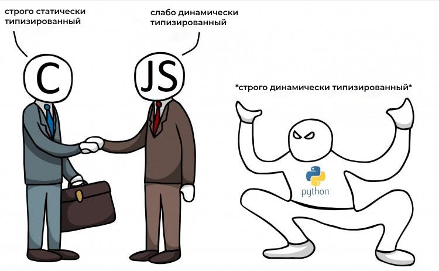

# Содержание
## Модуль 1: Основы типизации в Python
* **[1.1 Введение в типизацию: зачем, когда и как?](./ru-docs/Введение_в_типизацию.md)**
    * Динамическая и статическая типизация: плюсы и минусы
    * Типизация в Python: история и эволюция
    * Инструменты для статической типизации: mypy, PyCharm, другие
* **[1.2 Базовые типы данных:](./ru-docs/Базовые_типы_данных.md)**
    * int, float, str, bool: основы работы с типами
    * None: отсутствие значения и его особенности
    * Duck typing: неявная типизация в Python
* **[1.3 Коллекции и их типизация:](./ru-docs/Коллекции_и_их_типизация.md)**
    * list, tuple, dict, set: работа с коллекциями
    * Типизация коллекций: List\[int\], Tuple\[str, int\], Dict\[str, float\]
    *  Генераторы и итераторы: типизация и особенности
* **[1.4 Функции и типизация:](./ru-docs/Функции_и_типизация.md)**
    * Аннотация типов для аргументов и возвращаемого значения
    * Перегрузка функций и типы
    * Callable: работа с функциональными объектами
* **[1.5 Классы и типизация:](./ru-docs/Классы_и_типизация.md)**
    * Аннотация типов для атрибутов класса
    * Методы класса и типизация
    * Наследование и типизация: как типы взаимодействуют с наследованием
 
## Модуль 2: Продвинутая типизация
* **[2.1 Типизация с ипользованием TypeVar:](./ru-docs/Типизация_с_использованием_TypeVar.md)**
    * Создание универсальных функций и классов
    * Ограничение типов с помощью TypeVar
    * Практические примеры использования TypeVar
* **[2.2 Типы объединений (Union) и опциональные типы (Optional):](./ru-docs/Типы_объединений_и_опциональные_типы.md)**
    * Работа с переменными, которые могут иметь разные типы
    *  Использование Optional для обозначения  возможности отсутствия значения
* **[2.3 Типы псевдонимов:](./ru-docs/Типы_псевдонимов.md)**
    * Создание собственных имён для сложных типов
    * Повышение читаемости и удобства работы с кодом
* **[2.4 Типы Any, NoReturn:](./ru-docs/Типы_Any_и_NoReturn.md)**
    * Any:  отключение проверки типов для конкретной переменной
    * NoReturn: указание на то, что функция не возвращает значение
* **[2.5 Типы протоколов:](./ru-docs/Типы_протоколов.md)**
    * Определение интерфейсов для классов без явного наследования
    *  Structural typing: проверка типов по структуре, а не по имени
## Модуль 3:  Типизация в реальных проектах
* **[3.1 Интеграция mypy в рабочий процесс:](./ru-docs/Интеграция_mypy.md)**
    * Настройка mypy для проверки типов в проекте
    *  Интерпретация ошибок mypy и их исправление
* **[3.2 Stub файлы:](./ru-docs/Stub_файлы.md)**
    *  Что это такое и зачем нужны?
    *  Как типизировать сторонние модули
    * Генерация stub файлов