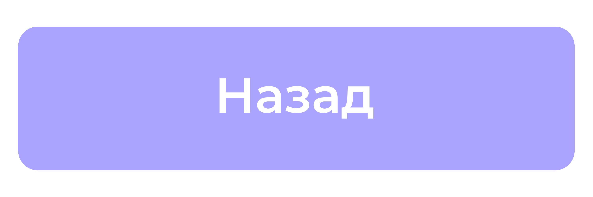
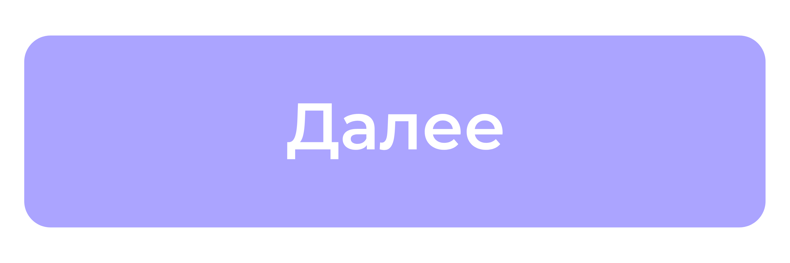

# 1.5 Классы и типизация
Типизация играет важную роль в объектно-ориентированном программировании на Python. Она позволяет создавать более надежный и понятный код, работая с классами и объектами.

## Аннотация типов для атрибутов класса
Вы можете использовать аннотации типов для определения типов атрибутов класса. Это делает код более читаемым и позволяет статическим анализаторам проверять корректность использования атрибутов.
```python
class Dog:
    name: str
    age: int

    def __init__(self, name: str, age: int):
        self.name = name
        self.age = age

    def bark(self) -> str:
        return "Woof!"

my_dog: Dog = Dog("Buddy", 3)
print(f"{my_dog.name} is {my_dog.age} years old.")  # Buddy is 3 years old.
print(my_dog.bark())  # Woof!
```

В этом примере мы указываем типы атрибутов `name` (str) и `age` (int)  в теле класса.

##  self и cls: типизация в методах класса
В методах класса `self` ссылается на текущий экземпляр объекта, а `cls` - на сам класс. 
* `self`:   Тип `self` обычно выводится автоматически и не требует явной аннотации.
* `cls`:  Для типизации `cls` используется `Type[T]`, где `T` - это тип класса.

```python
from typing import Type

class Animal:
  name: str

  def __init__(self, name: str):
    self.name = name

  @classmethod
  def create(cls: Type["Animal"], name: str) -> "Animal":
    return cls(name)

my_animal: Animal = Animal.create("Leo")
print(my_animal.name) # Output: Leo
```

В этом примере `cls` в методе `create` имеет тип `Type["Animal"]`, что указывает на то, что он ссылается на сам класс `Animal`.

## Наследование и типизация
При наследовании типов важно учитывать, что дочерние классы могут переопределять методы родительских классов. Аннотации типов должны быть совместимы с типами в родительском классе, чтобы избежать ошибок типизации. 
```python
class Animal:
  name: str

  def speak(self) -> str:
    raise NotImplementedError

class Dog(Animal):
  def speak(self) -> str:
    return "Woof!"

class Cat(Animal):
  def speak(self) -> str:
    return "Meow!"
```

В этом примере метод `speak` в родительском классе `Animal` не имеет реализации (`NotImplementedError`). Дочерние классы `Dog` и `Cat` переопределяют этот метод, предоставляя свою реализацию. Важно, чтобы возвращаемый тип метода `speak`  в дочерних классах  был совместим с типом, указанным в родительском классе (`str`).

Типизация классов и объектов в Python способствует созданию более структурированного, надежного и понятного кода, что особенно важно в крупных проектах.


***

<div align="center">
    <a href="./Функции_и_типизация.md">
        
    </a>
    <a href="./Типизация_с_использованием_TypeVar.md">
        
    </a>
</div>